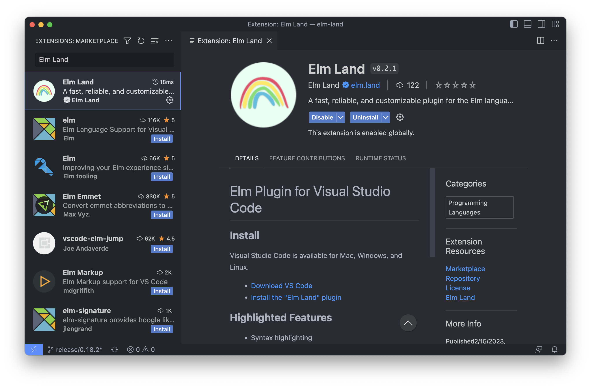

# Getting started

<h3>What you'll learn</h3>

1. How to __[install Elm Land](#installation)__
1. How to __[create a new project](#creating-a-new-project)__
1. How to __[run the dev server](#running-the-dev-server)__
1. How to __[set up your editor](#editor-setup)__

## Installation

__Prerequisite:__ [Node.js](https://nodejs.org) (v18.16.0 or higher)

Elm Land comes with a single [CLI tool](https://www.npmjs.com/package/elm-land) to help you create new projects, add features, run your dev server, and more. You can install it with the following command:

```sh
npm install -g elm-land@latest
```


::: details Getting any unexpected NPM errors?

Sometimes, folks encounter issues with the `-g` flag. If you see an `EACCES` error, check out [this official NPM guide](https://docs.npmjs.com/resolving-eacces-permissions-errors-when-installing-packages-globally) on how to fix the problem. 

If you are still stuck, stop by the [Elm Land Discord](https://join.elm.land). Let's figure it out together!

:::

## Creating a new project

You can use the `elm-land` CLI tool to create new projects. Here is how to use it to make new project in the "quickstart" folder:

```sh
elm-land init quickstart
```

Every new Elm Land project is created with these three files:

```bash
quickstart/
  |- elm.json           # 🌐 Elm's `package.json` file
  |- elm-land.json      # 🌈 Elm Land configuration
  |- src/
     |- Pages/
        |- Home_.elm    # 🏡 The homepage for our app
```

__Note:__ You'll also see a `README.md` and `.gitignore` file, to help when uploading to GitHub or any other git-based [version-control system](https://en.wikipedia.org/wiki/Version_control).

## Running the dev server

The Elm Land CLI comes with a built in development server. Here's how to run your new project in the web browser:

```sh
elm-land server
```

You should see "Hello, world!" when you open `http://localhost:1234`

<BrowserWindow src="/images/guide/hello-world.jpg" alt="Hello, world!" />


## Editor setup

We recommend using VS Code with [__the official Elm Land plugin__](https://marketplace.visualstudio.com/items?itemName=elm-land.elm-land) for the best experience. If you prefer to use another editor, check out these [other editor plugins](https://github.com/elm/editor-plugins).

1. Install [Visual Studio Code](https://code.visualstudio.com/)
1. Install the [Elm Land extension](https://marketplace.visualstudio.com/items?itemName=elm-land.elm-land)



__Note:__ The Elm Land plugin will automatically prompt you if you need to install `elm` or `elm-format`, which are the standard ways to build and format your project.


<h3>You made it!</h3>

Congratulations on getting started with Elm Land. Depending on your prior experience, here's what we recommend next:

---

🌱 __New to Elm?__ 

Perfect! The rest of the guides were written just for you! These mini-projects will gradually introduce you to everything you need to be productive with Elm Land.

---

🌳 __Already experienced with Elm?__ 

We recommend jumping ahead to [the "Concepts" section](/concepts/). Those pages will teach you the core concepts of Elm Land. There is also a gallery of [examples](/examples/) if you want to see what's possible!

---

__Either way__, be sure to join the [Elm Land Discord](https://join.elm.land) to get help if you're stuck or to make new friends. We hope you have an _awesome_ experience with Elm Land, and can't wait to see what you build!

